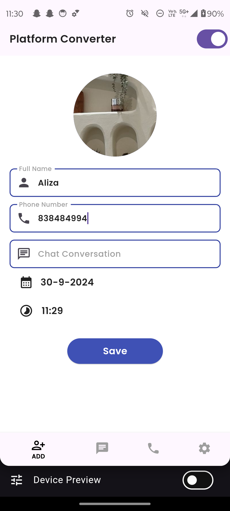
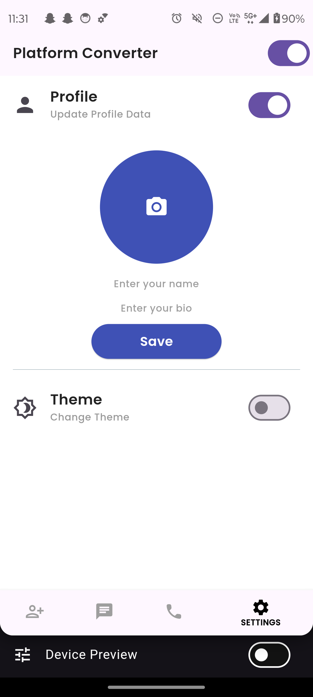
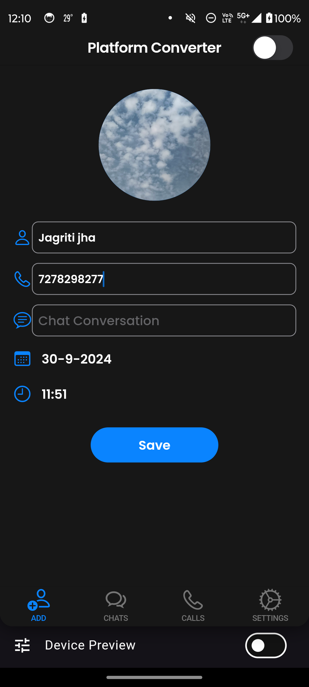
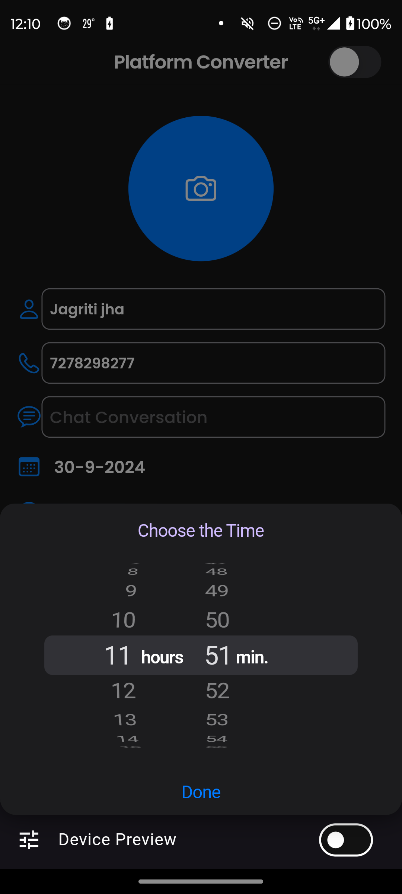

<table style="border-collapse: collapse; width: 100%;">
  <tr>
    <th colspan="6" style="text-align: center; border: 0;">Android Dark Mode Screenshots</th>
  </tr>
  <tr>
    <td style="width: 220px; border: 0;">
      
    </td>
    <td style="width: 220px; border: 0;">
      
    </td>
    <td style="width: 220px; border: 0;">
      
    </td>
    <td style="width: 220px; border: 0;">
      
    </td>
    <td style="width: 220px; border: 0;">
      
    </td>
    <td style="width: 220px; border: 0;">
      
    </td>
  </tr>
  <tr>
    <td style="width: 220px; border: 0;">
      
    </td>
    <td style="width: 220px; border: 0;">
      
    </td>
    <td style="width: 220px; border: 0;">
      
    </td>
  </tr>
  <tr>
    <th colspan="6" style="text-align: center; border: 0;">Android Light Mode Screenshots</th>
  </tr>
  <tr>
    <td style="width: 220px; border: 0;">
      
    </td>
    <td style="width: 220px; border: 0;">
      
    </td>
    <td style="width: 220px; border: 0;">
      
    </td>
    <td style="width: 220px; border: 0;">
      
    </td>
    <td style="width: 220px; border: 0;">
      
    </td>
    <td style="width: 220px; border: 0;">
      
    </td>
  </tr>
  <tr>
    <td style="width: 220px; border: 0;">
      
    </td>
    <td style="width: 220px; border: 0;">
      
    </td>
    <td style="width: 220px; border: 0;">
      
    </td>
    <td style="width: 220px; border: 0;">
      
    </td>
  </tr>
  <tr>
    <th colspan="6" style="text-align: center; border: 0;">iOS Dark Mode Screenshots</th>
  </tr>
  <tr>
    <td style="width: 220px; border: 0;">
      
    </td>
    <td style="width: 220px; border: 0;">
      
    </td>
    <td style="width: 220px; border: 0;">
      
    </td>
    <td style="width: 220px; border: 0;">
      
    </td>
    <td style="width: 220px; border: 0;">
      
    </td>
    <td style="width: 220px; border: 0;">
      
    </td>
  </tr>
  <tr>
    <td style="width: 220px; border: 0;">
      
    </td>
  </tr>
  <tr>
    <th colspan="6" style="text-align: center; border: 0;">iOS Light Mode Screenshots</th>
  </tr>
  <tr>
    <td style="width: 220px; border: 0;">
      
    </td>
    <td style="width: 220px; border: 0;">
      
    </td>
    <td style="width: 220px; border: 0;">
      
    </td>
    <td style="width: 220px; border: 0;">
      
    </td>
    <td style="width: 220px; border: 0;">
      
    </td>
    <td style="width: 220px; border: 0;">
      
    </td>
  </tr>
  <tr>
    <td style="width: 220px; border: 0;">
      
    </td>
    <td style="width: 220px; border: 0;">
      
    </td>
    <td style="width: 220px; border: 0;">
      
    </td>
    <td style="width: 220px; border: 0;">
      
    </td>
  </tr>
</table>
